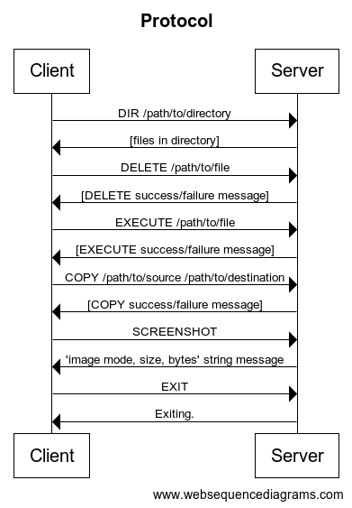

# Ex2.7
Exercise 2.7 for school.

### Protocol

I used the following protocol:

    <cmd_length><cmd><data_length><data>
    cmd_length - 4-byte unsigned int (network byte order), the length of the command.
    cmd - string, the command to be executed/the command that has executed.
    data_length - 4-byte unsigned int (network byte order), the length of the data.
    data - string, the arguments to the command/the data received from the command.
The arguments passed to the command are in the form of `"(arg1, arg2, ...)"`. When using `eval()` on that string, it
will be converted to a tuple of all these arguments, or if there's only one argument it will be that one argument.

I also chose to use only `/` (forward-slash) instead of `\​` (backslash) because it works better with `eval()` and
`shlex.split()` (Used for the client input).

Sequence diagram:

### Commands

`DIR <path>`: Shows the files in the directory at `<path>`.

`DELETE <path>`: Deletes the file at `<path>`.

`COPY <source> <destination>`: Copies the file at `<source>` to `<destination>`.

`EXECUTE <path>`: Executes the executable at `<path>`.

`SCREENSHOT`: Takes a screenshot, saves
it as `image.jpg` in the server, and then sends the screenshot to the client and saves it as `image.jpg` on the client.

`EXIT`: Disconnects the client from the server.

When the path has spaces, it should be put between quotation marks like this: `DIR "/path with spaces/to/file"`.

### General info

I combined the commands `TAKE_SCREENSHOT` and `SEND_PHOTO` into one command `SCREENSHOT` that takes a screenshot, saves
it as `image.jpg` in the server, and then sends the screenshot to the client and saves it as `image.jpg` on the client.

Apparently the code of the keyboard interrupts that I also used in 2.6 works only on linux and not on windows, and I couldn't get anything else to work :( I tried signals, threading, and other stuff, and it didn't work. I still left it here because I believe that every OS equally important :)
